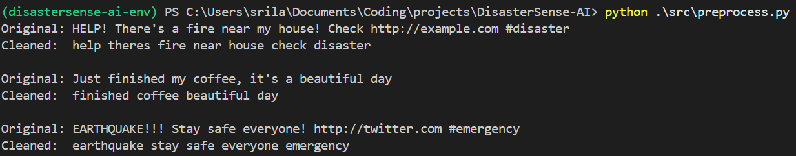
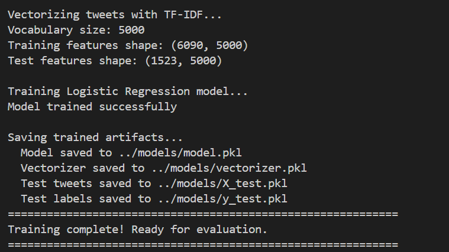
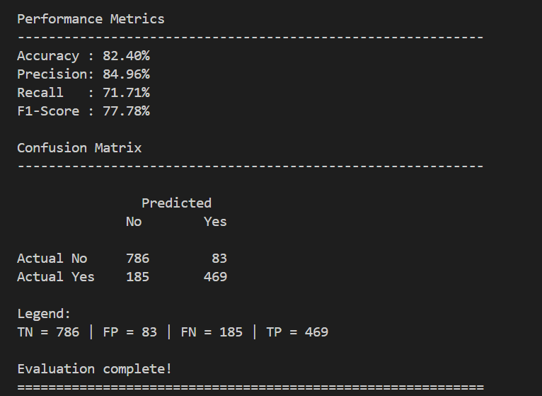
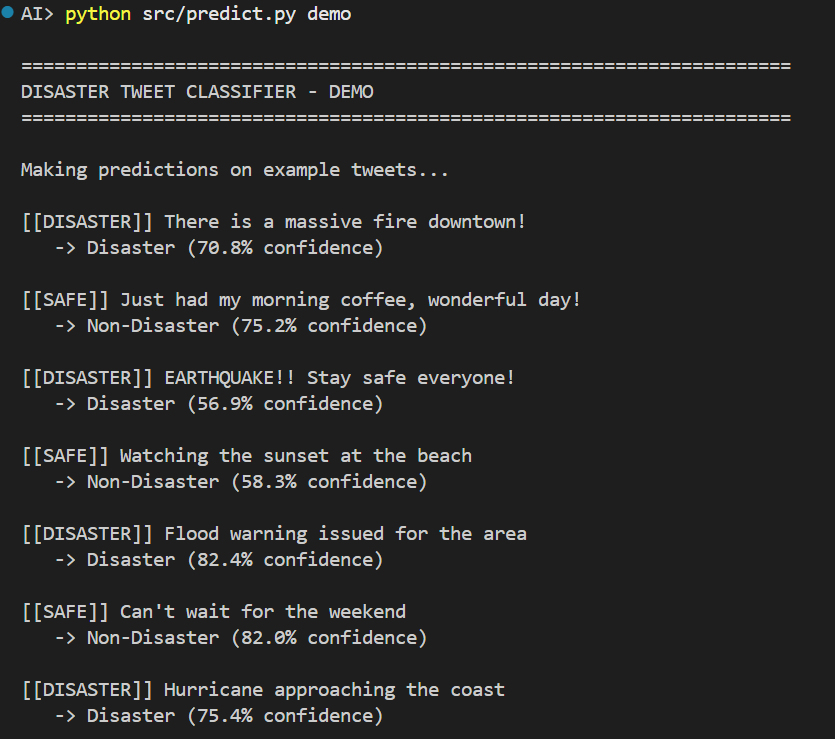
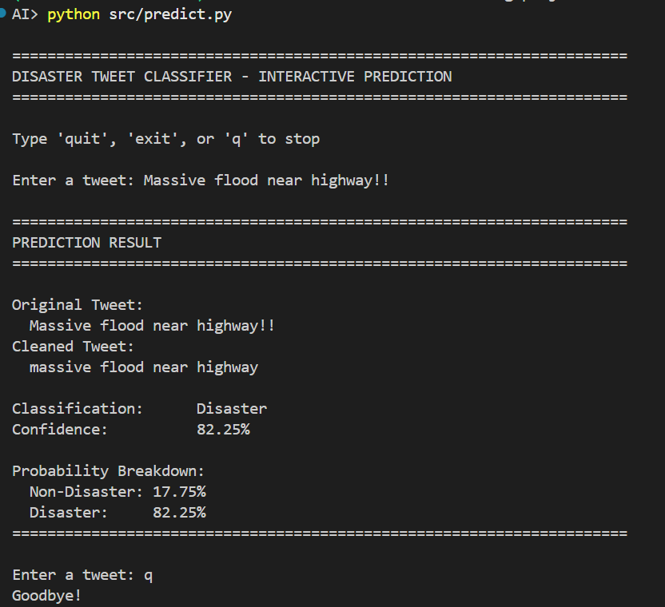

# 🚨 DisasterSense-AI

An NLP-powered disaster tweet classification system using TF-IDF vectorization and Logistic Regression.

---

## Project Structure

```text
DisasterSense-AI/
├── data/
│   └── tweets.csv
│   └── train.csv
├── screenshots/
├── scripts/
│   └── prepare_tweets_csv.py
├── src/
│   ├── preprocess.py
│   ├── train.py
│   ├── evaluate.py
│   └── predict.py
├── README.md
└── requirements.txt
```

## Environment Setup

### 1. Navigate to the Project Directory

```bash
cd DisasterSense-AI
```

### 2. Create and activate Virtual Environment

```bash
python -m venv disastersense-ai-env
```
```bash
.\disastersense-ai-env\Scripts\Activate
```

### 3. Install Required Dependencies

```bash
pip install -r requirements.txt
```
---

## Installed Libraries

The project currently uses:

- pandas
- scikit-learn
- nltk
- numpy

The following screenshot shows successful virtual environment activation and dependency installation.


## Dataset Preparation

The project uses the Kaggle Disaster Tweets dataset as the primary data source.

The original `train.csv` file contains multiple columns, but only the following are required for this project:

- `text` → tweet content
- `target` → disaster classification label

A dataset preparation script processes the raw dataset and converts it into a simplified `tweets.csv` format used during training.

### Input Dataset

```text
train.csv
```

### Output Dataset

```text
tweets.csv
```

### Preparation Script

Run the following command:

```bash
cd scripts
python prepare_tweets_csv.py
```

### Example Terminal Output

```text
Loaded 7613 rows from train.csv
Saved processed dataset to: data/tweets.csv
Final dataset size: 7613 rows
```

## Text Preprocessing

Raw tweets contain:
- URLs, punctuation, uppercase words, common stopwords

These create noise and make it harder for the model to learn useful patterns.

The preprocessing pipeline cleans tweets before training.

---

## Preprocessing Steps

- Remove URLs
- Convert text to lowercase
- Remove punctuation
- Tokenize words
- Remove stopwords

---

## Example

### Input Tweet

```text
HELP! There's a fire near my house! Check http://example.com #disaster
```

### Processed Tweet

```text
help fire near house check disaster
```

---

## Run Preprocessing Module

```bash
cd src
python preprocess.py
```

---

## Preprocessing Output



## Run Training Module

```bash
python train.py
```

---

## Training Pipeline Output



## Run Evaluation Module
```bash
python evaluate.py
```

---

## Model Evaluation Results



## Model Performance

Current model performance on the test dataset:

- Accuracy: ~82%
- Precision: ~85%
- Recall: ~72%
- F1-Score: ~78%

## Model Tuning Experiments

Additional experiments were performed using custom class weights to improve disaster tweet recall.

These experiments highlighted the tradeoff between:
- recall improvement
- false positives
- overall F1-score balance

The final model configuration was selected based on balanced overall performance.

## Tweet Prediction

The trained model can classify new tweets as:
- Disaster
- Non-Disaster

Run prediction script:

```bash
python predict.py
```

### Prediction Demo





## Future Improvements

Possible future enhancements:
- Streamlit web application
- Advanced NLP models
- Real-time tweet monitoring
- Explainable AI visualizations
- Deployment using cloud platforms