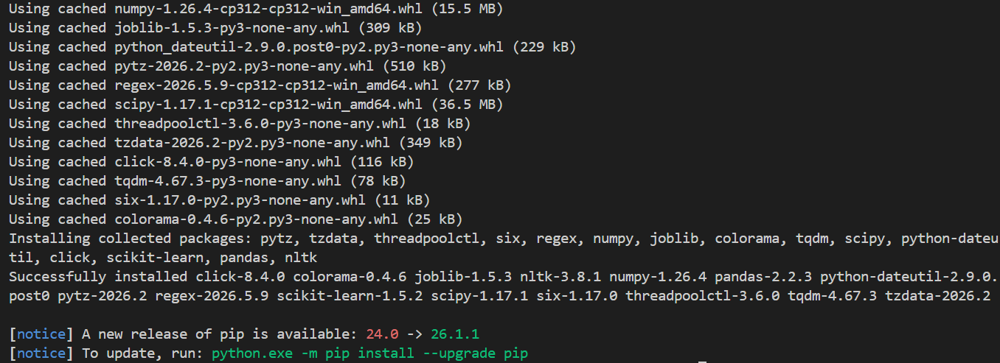

# 🚨 DisasterSense-AI

An NLP-powered disaster tweet classification system using TF-IDF and Machine Learning.

---

## Environment Setup

### 1. Navigate to the Project Directory

```bash
cd DisasterSense-AI
```

### 2. Create and activate Virtual Environment

```bash
python -m venv disastersense-ai-env
```
```bash
.\disastersense-ai-env\Scripts\Activate
```

### 4. Install Required Dependencies

```bash
pip install -r requirements.txt
```
---

## Installed Libraries

The project currently uses:

- pandas
- scikit-learn
- nltk
- numpy

The following screenshot shows successful virtual environment activation and dependency installation.



## Dataset Preparation

The project uses the Kaggle Disaster Tweets dataset as the primary data source.

The original `train.csv` file contains multiple columns, but only the following are required for this project:

- `text` → tweet content
- `target` → disaster classification label

A dataset preparation script processes the raw dataset and converts it into a simplified `tweets.csv` format used during training.

### Input Dataset

```text
train.csv
```

### Output Dataset

```text
tweets.csv
```

### Preparation Script

Run the following command:

```bash
cd scripts
python prepare_tweets_csv.py
```

### Example Terminal Output

```text
Loaded 7613 rows from train.csv
Saved processed dataset to: data/tweets.csv
Final dataset size: 7613 rows
```